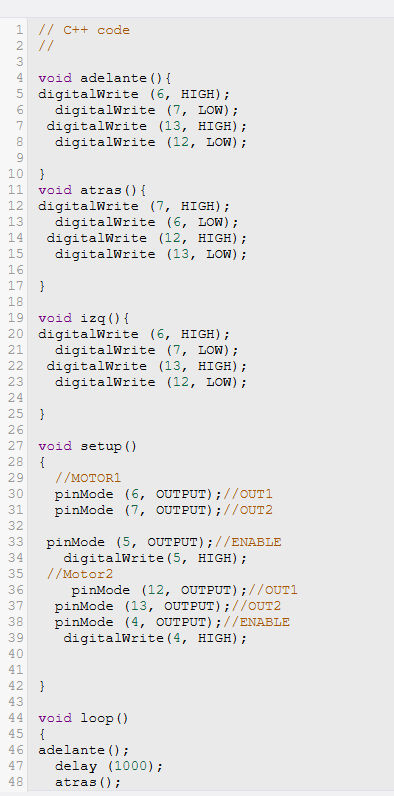

---
En la clase de hoy vimos cómo funciona un motor L298. Primero, la profesora nos explicó su funcionamiento utilizando un motor físico y una fuente de poder. Observamos que, al conectar el motor a la fuente de una manera, este comienza a girar en un sentido, y al conectarlo al revés, gira en el sentido contrario.

Después de esto, realizamos un circuito en Tinkercad utilizando una placa Arduino. En este circuito programamos dos motores para que giraran en la misma dirección. Con esta práctica pudimos observar de manera más clara cómo se puede controlar el movimiento de los motores mediante Arduino.
.jpg)
<iframe width="560" height="315" src="https://www.youtube.com/embed/QCtgiOJMJZ4?si=utm7qT6s119l6PW3" title="YouTube video player" frameborder="0" allow="accelerometer; autoplay; clipboard-write; encrypted-media; gyroscope; picture-in-picture; web-share" referrerpolicy="strict-origin-when-cross-origin" allowfullscreen></iframe>

---
Luego de eso, hicimos que los dos motores giraran en la misma dirección y después cambiaran a la dirección contraria utilizando un código diferente.

---
Después hicimos un circuito con los mismos motores, en el que primero giraban hacia delante y después hacia atrás. Posteriormente, los motores hacían un giro hacia el lado izquierdo.
.png)
