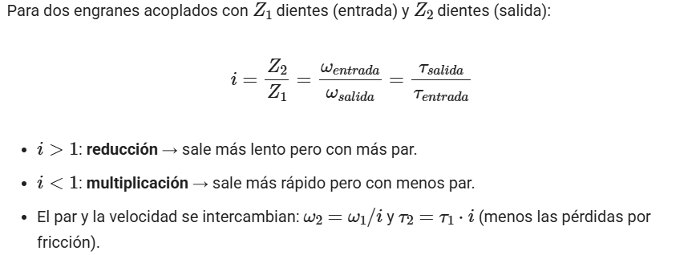
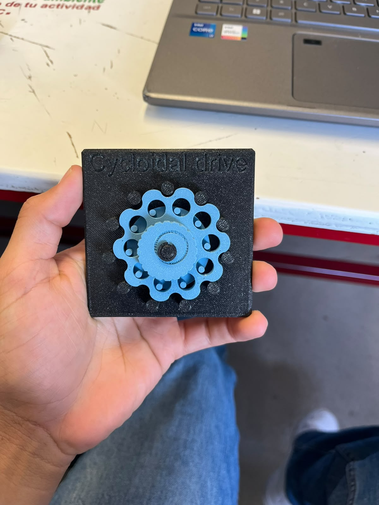
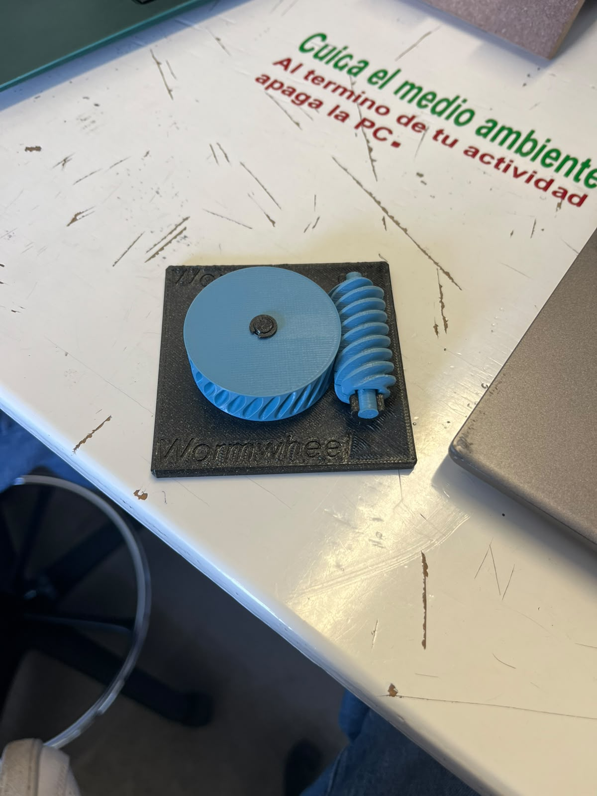
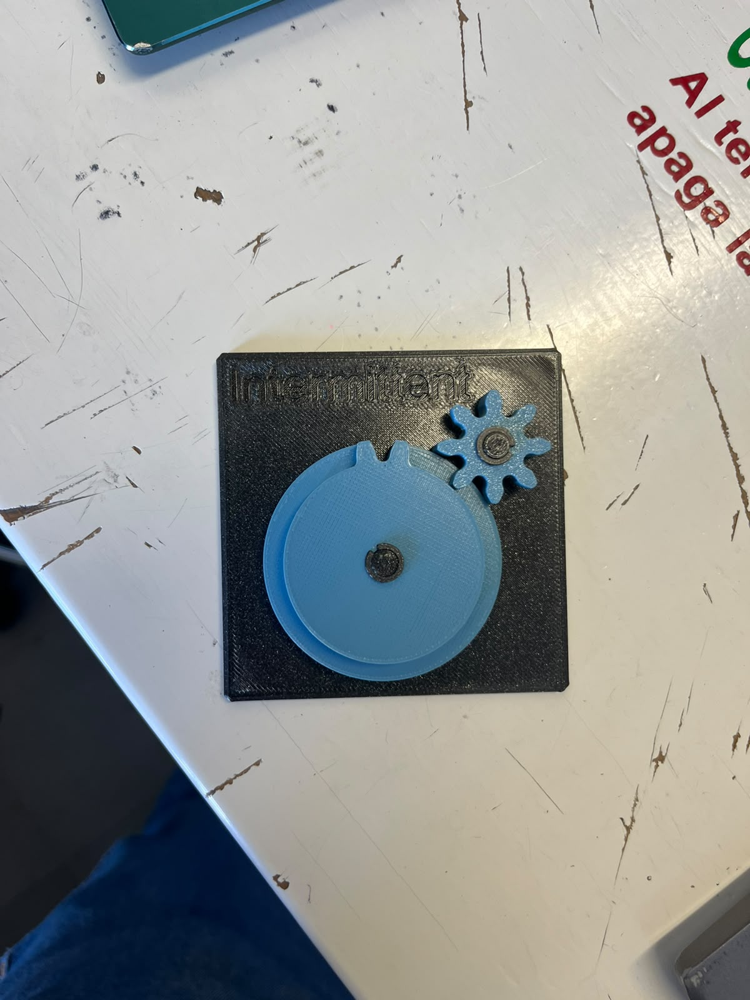
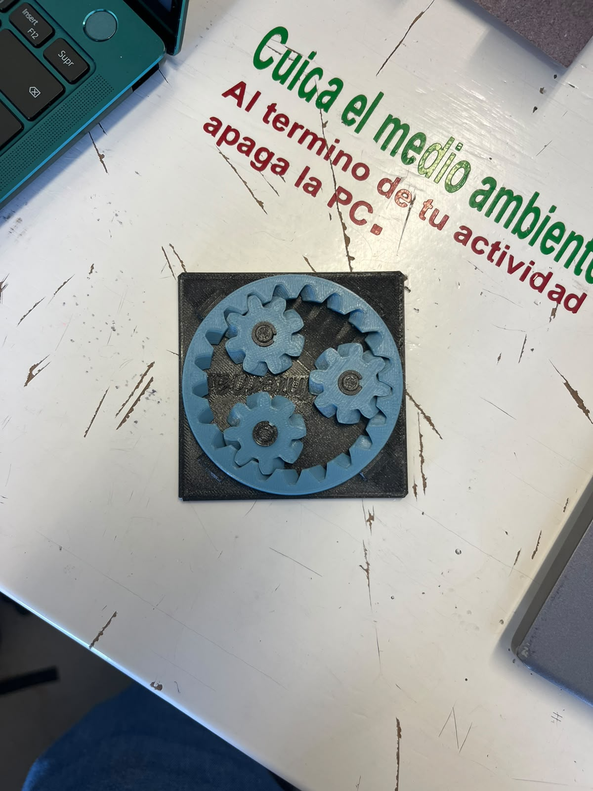
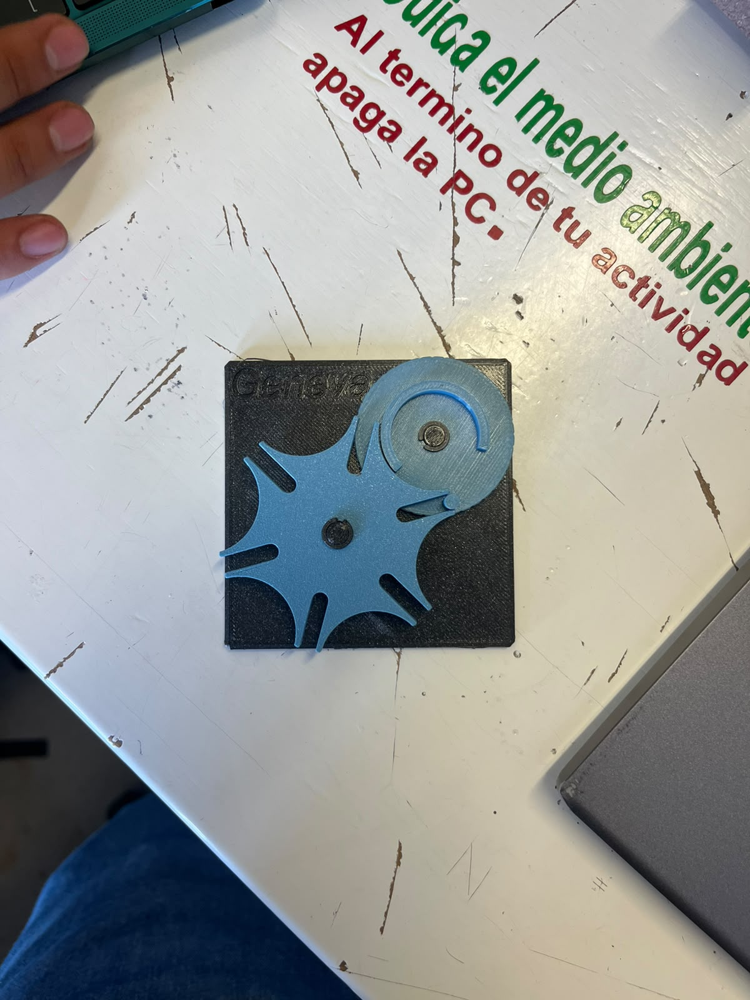
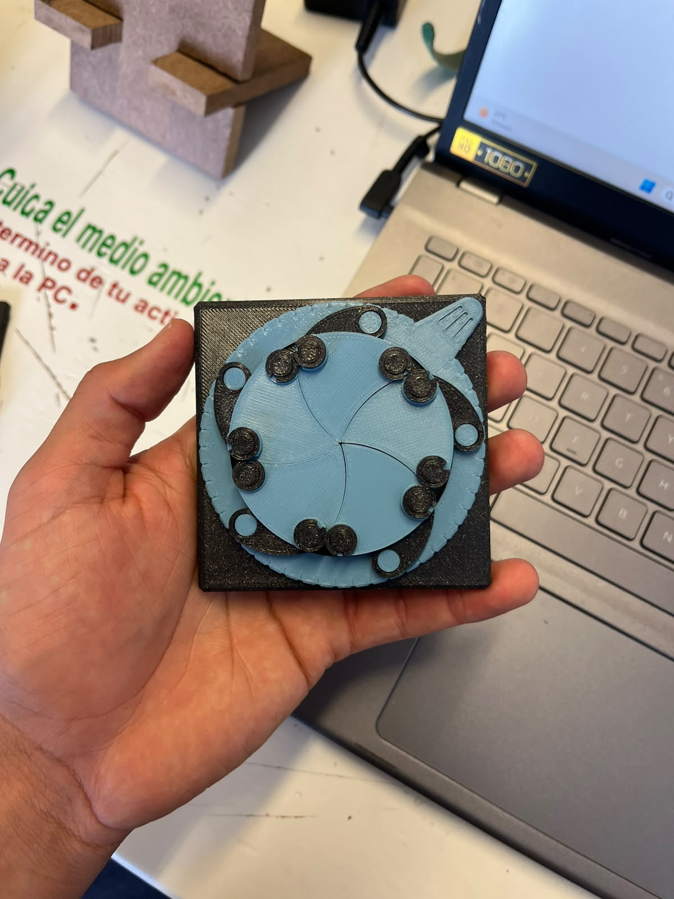

MECANISMOS
---
Primero, en la clase de hoy Oliver comenzó preguntándonos si conocíamos algún mecanismo. Después de que le mencionamos algunos ejemplos, comenzó a explicarnos cómo funcionan y vimos algunos ejemplos para entenderlos mejor. También realizamos algunos cálculos utilizando la siguiente fórmula:

---
Luego oliover nos pidio hacer una ficha de estacion 

---
Posteriormente, Oliver nos pasó algunos mecanismos para que pudiéramos observarlos y analizarlos. Después teníamos que identificar cómo funcionaba cada uno y pensar en qué situaciones o proyectos se podría utilizar. Esto nos ayudó a entender mejor para qué sirve cada mecanismo y cómo se puede aplicar en diferentes situaciones.
En este mecanismo hay una pieza que gira de una forma un poco diferente y hace que otra pieza también se mueva. Su función principal es hacer que el movimiento sea más lento, pero con más fuerza.
Ejemplo: Se puede usar en robots, por ejemplo, en las partes que necesitan moverse y al mismo tiempo tener suficiente fuerza.

Este mecanismo tiene una pieza parecida a un tornillo y otra con dientes. Cuando el tornillo gira, hace que la otra pieza también gire, pero más lentamente. Esto sirve para poder mover cosas que necesitan bastante fuerza.
Ejemplo: Se puede encontrar en algunas máquinas y elevadores, donde se necesita mover algo pesado poco a poco.

Este mecanismo hace que una pieza se mueva durante un momento y después se quede quieta. Después vuelve a moverse y así sucesivamente.
Ejemplo: Se puede usar en máquinas de producción, donde se necesita que un objeto avance, se detenga para hacer algo y después vuelva a avanzar.

Son varias ruedas con dientes que se conectan entre sí. Cuando una rueda gira, hace que la otra también gire. Dependiendo del tamaño de las ruedas, el movimiento puede hacerse más rápido o más lento.
Ejemplo: Los podemos encontrar en relojes, donde los engranajes ayudan a que las manecillas se muevan.

Este mecanismo tiene una rueda en el centro y otras ruedas pequeñas que se mueven alrededor de ella. Al trabajar juntas pueden hacer que un movimiento sea más rápido o más lento y también pueden aumentar la fuerza.
Ejemplo: Se utiliza en los automóviles, especialmente en las transmisiones, para poder tener diferentes velocidades.

Este mecanismo hace que una pieza avance poco a poco en lugar de girar todo el tiempo. Primero se mueve hasta una posición, después se detiene y luego vuelve a avanzar.
Ejemplo: Se puede utilizar en máquinas que necesitan mover objetos por partes, haciendo que cada objeto llegue a un lugar específico antes de continuar.

En conclusión, en esta clase pude aprender un poco más sobre los mecanismos y sobre la forma en que funcionan. Al principio no conocía muy bien cómo trabajaba cada uno, pero al poder observarlos y analizarlos fue más fácil entender qué movimiento realiza cada uno y para qué puede servir. También los cálculos y la ficha de estación me ayudaron a complementar lo que vimos durante la clase. Me pareció interesante ver que mecanismos que pueden parecer sencillos pueden utilizarse en diferentes máquinas, robots, automóviles y otros proyectos. En general, la actividad me ayudó a conocer mejor los mecanismos y a darme una idea de cómo se pueden aplicar en situaciones de la vida real.