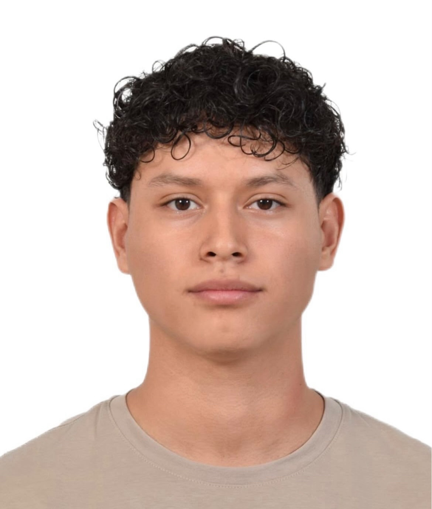

Carlos Eduardo Martinez Perea
---
Yo soy Carlos Eduardo Martínez Perea, soy del estado de Morelos y actualmente me encuentro estudiando en Puebla, en la Universidad Iberoamericana Puebla. Escogí esta carrera porque desde hace tiempo siempre me ha interesado el hecho de armar y desarmar cosas. Por ejemplo, hace tiempo desarmé un control de PlayStation 4 y después lo volví a armar, al igual que un mouse. También, hace algunos meses armé una PC desde cero con la ayuda de un amigo, y fue una experiencia que me gustó mucho porque pude conocer un poco más sobre cómo funcionan sus componentes.

Entre mis pasatiempos favoritos está ver películas, así como ver y jugar fútbol, pero mi pasatiempo preferido es ir al GYM, ya que es algo que disfruto hacer y que forma parte de mi rutina.

---

---

Esta fue mi primera clase de Introducción a la Mecatrónica, en la cual aprendí a crear una página desde cero utilizando Visual Studio Code, que es un programa que nos permite escribir y editar el código necesario para crear diferentes proyectos. Durante la clase, con los comandos que Oliver nos iba enseñando, aprendimos poco a poco a utilizarlo y a realizar nuestra página. También nos enseñó a subir nuestros documentos a GitHub, que es una plataforma donde podemos guardar y organizar nuestros proyectos para ir viendo los cambios y el progreso que vamos teniendo. De esta manera, pude conocer algunas de las herramientas que estaremos utilizando a lo largo de esta clase y empezar a familiarizarme con ellas.
